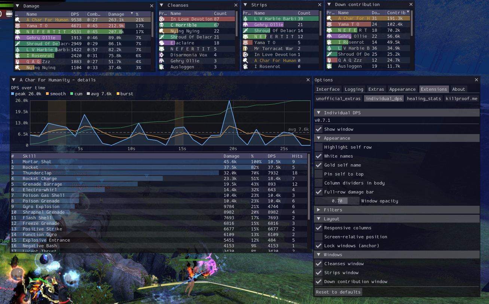

# arcdps_individual_dps

ArcDPS extension that restores individual combat time after the
**April 14, 2026** arcdps update collapsed every fight stat to a single
group clock. Each squad member has their own clock that pauses on
`CBTS_EXITCOMBAT` and resumes on `CBTS_ENTERCOMBAT`, so personal DPS
stops diluting when you drop out of combat while others stay engaged.



## Download

[Download Latest Release](https://github.com/iTroy0/arcdps_individual_dps/releases/latest)


## Features

- **Damage / DPS per player** in a live ImGui window with EMA-smoothed
  DPS column (refresh every ~500ms so the number doesn't strobe)
- **Active-damage window** denominator (matches arcdps's Damage panel)
- **Per-self fight boundaries** — your row resets on your own next
  ENTERCOMBAT. A squadmate pulling a boss never resets your row while
  you are still out of combat
- **Profession icons + colored names** 
- **Click a row** for a detail window:
  - DPS-over-time line chart with y-axis grid, vertical crosshair on
    hover, and a tooltip showing time / DPS (with `k` suffix) /
    cumulative damage
  - Per-skill breakdown (rank / skill name / damage / DPS / hits),
    sorted by damage. Per-skill DPS uses the skill's own active window
    (first → last hit) instead of the whole-fight denominator
  - **ESC** closes the detail window when it has keyboard focus
- **Cleanses + Strips** side windows, toggleable
- **NPC / Gadget exclusion** filters (uses deltaconnected's authoritative
  target classification rules)
- **Window opacity slider** (0.10 – 1.00) applied to all four plugin
  windows. Lives in the right-click context menu and the arcdps options
  panel
- **Settings persisted** to `arcdps_individual_dps.ini` — main and
  detail window position/size, sort column, filters, visibility, and
  background opacity
- **Self-contained DLL** — static MSVC runtime, no redistributable needed

## Install

1. Build (see below) or grab a release.
2. Drop `arcdps_individual_dps.dll` next to arcdps
   (`<GW2>/addons/arcdps_individual_dps.dll` or `<GW2>/addons/`).
3. Launch GW2. Verify via arcdps options → Extensions — should list
   `individual_dps` v0.4.1.

Icons are embedded in the DLL. If they fail to load for any reason, drop
`specs/*.png` into `<GW2>/addons/individual_dps_icons/` as a file fallback.

## Usage

- **Main window** titled `Damage`. Resize by dragging.
- **Click a player's row** → opens their detail window with damage graph
  and skill breakdown. Resizable + scrollable. Hover the graph for a
  vertical crosshair, dot marker, and tooltip; press **ESC** to close.
- **Right-click inside the main window** → context menu with:
  - Exclude NPCs
  - Exclude Gadgets
  - Sort (Damage / DPS / Name / Combat time)
  - Cleanses window toggle
  - Strips window toggle
  - Window opacity slider
- **ArcDPS options → Individual DPS** — same controls plus a show/hide
  toggle for the main window.

## Build

MSVC x64, CMake 3.20+, Visual Studio 2022 Build Tools.

```bat
cmake -S . -B build -A x64
cmake --build build --config Release
```

Output: `build/Release/arcdps_individual_dps.dll`.

`FetchContent` pulls ImGui `v1.80` (matches what current arcdps ships) and
`stb_image` (for PNG decoding). If arcdps bumps its ImGui version, update
the tag in `CMakeLists.txt` — bundling a mismatched version corrupts
shared ImGui state.

To use a local ImGui source instead of FetchContent:

```bat
cmake -S . -B build -A x64 -DIMGUI_DIR=C:/path/to/imgui
```

The MSVC runtime is statically linked (`/MT`) so the DLL runs without the
Visual C++ redistributable installed on the target machine.

## Tech Stack

- C++17, MSVC x64, static CRT
- CMake 3.20+ build, FetchContent deps
- Dear ImGui 1.80 (shared arc context), stb_image for PNG decode
- Direct3D 11 textures (arc-provided device, deferred to render thread)
- arcdps extension ABI (`mod_combat`, `mod_imgui`, `options_end`, etc.)

## Layout

```
/
  CMakeLists.txt
  include/
    arcdps_api.h           # vendored arcdps types
  res/
    icons.rc               # embedded profession/elite PNGs
  specs/
    001..009.png           # core prof icons
    e101..e904.png         # elite spec icons
  src/
    main.cpp               # DLL entry, get_init_addr / get_release_addr
    exports.cpp/.h         # arcdps_exports table + version string
    combat.cpp/.h          # mod_combat / mod_combat_local dispatch
    tracker.cpp/.h         # per-agent state, damage, strips, cleanses, skills
    ui.cpp/.h              # windows: Damage, detail, Strips, Cleanses
    icons.cpp/.h           # D3D11 texture loading (resource + file)
    settings.cpp/.h        # ini load/save
    log.cpp/.h             # debug log (arcdps_individual_dps.log)
```

## Behavior notes

- **Combat time** = time between first and last credited damage event
  (extended to "now" while the player is in combat). Matches arc's
  `Damage (excl)` panel denominator, not the combat-flag duration.
- **Per-self LOGSTART** — `CBTS_LOGSTART` does not wipe the squad. Each
  player's row resets via their own next `CBTS_ENTERCOMBAT` (or the
  implicit-enter described below). A squadmate's boss pull cannot reset
  rows for players who are still out of combat.
- **Implicit-enter** — if arc ever fails to deliver `CBTS_ENTERCOMBAT`
  before damage events, the first credited *self-source strike* (`src->self`
  with `ev->buff == 0`) opens a new fight. Pets, minions, and condition
  ticks cannot cold-start a fight on their own — they may extend combat
  only when the squad is already fighting. An idle gap of more than 5s
  outside an `in_encounter_` log also acts as a fight boundary so
  open-world pulls don't leak damage between encounters.
- **Damage filter** — strike events with result `BLOCK / EVADE /
  INTERRUPT / ABSORB / BLIND` are dropped by result code; anything else
  counts only when `ev->value > 0`. Negative values in arc's
  post-2026-04-14 feed appear on barrier-absorbed / invulnerable hits
  and arc itself does not count them toward DPS.
- **combat_local** callback is a no-op: arc fires the same payload
  on both `combat` and `combat_local`, so processing both double-counts.
- **Buff events** — strips and cleanses use arc's `is_buffremove != 0`
  flag on buff events, filtered by a hardcoded list of boons (12 ids)
  and damaging/non-damaging conditions (14 ids).
- **History sampling** — per-agent cumulative damage is sampled every
  ~500ms into a ring buffer (capped at 4096 points) for the detail-window
  graph. The graph computes per-sample DPS over a 1-second rolling
  lookback so peak readings line up with arc's panel.
- **D3D11 texture creation** is deferred to the first `mod_imgui` call
  on the render thread. Creating SRVs from the early `get_init_addr`
  path crashed inside the d3d driver on some setups (NVIDIA reproducer).
- **DPS column smoothing** — the live DPS column applies an exponential
  moving average (3:1 weight, ~500ms cadence) so the number reads calmly
  instead of ticking every frame.

## Versioning

- `0.1.0` — phase 1 tracker + minimal debug UI.
- `0.2.0` — colored names, prof icons, strips/cleanses, context-menu
  options, settings persistence, arcdps options panel entry.
- `0.3.0` — click-to-drill-down detail window with damage-over-time graph
  and per-skill breakdown.
- `0.4.0` — graph polish (y-axis grid, crosshair, k-suffix tooltip,
  rolling-window DPS), per-skill active-window DPS, window opacity
  slider, ESC closes detail, per-self LOGSTART, implicit-enter on first
  self-strike, deferred d3d resource creation, restored DPS smoothing.
- `0.4.1` — internal audit pass: O(1) damage-history FIFO (deque),
  reused render buffers (no per-frame heap churn), shorter mutex window
  in `detail()`, lazy-register squadmates whose `ENTERCOMBAT` arrives
  before their tracking-add, `g_dps_cache` pruning across long sessions,
  geometry clamp on settings load, centralized version string,
  `combat_local` no-op dispatch removed. No behavior changes.

## License

Unlicensed personal project. Not affiliated with arcdps, deltaconnected,
or ArenaNet. Follows arcdps's "don't be a dick" policy — no network
calls, no file I/O outside the debug log + settings ini.

---

Made with ❤️ by Troy
